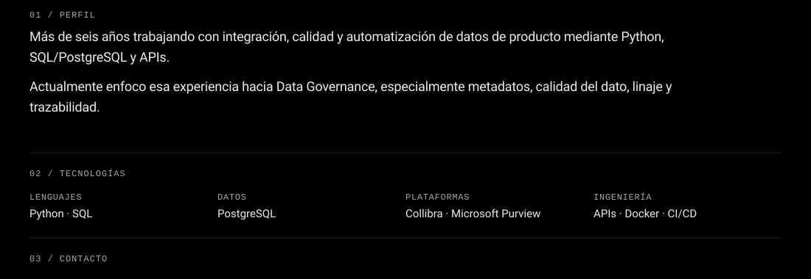

<!--
  GitHub Profile README (ES).
  Módulo negro continuo: tabla sin gaps + bgcolor #000.
  EN/ES = tiles compactos (sin imagen de relleno → evita wrap y banda flotante).
  body.svg = Perfil + Tecnologías + Contacto en una superficie.
  Portfolio / LinkedIn siguen siendo enlaces independientes.
-->
<table align="center" border="0" cellpadding="0" cellspacing="0" width="100%">
<tr>
<td align="right" bgcolor="#000000">

</td>
</tr>
<tr>
<td bgcolor="#000000">

</td>
</tr>
<tr>
<td bgcolor="#000000">

</td>
</tr>
<tr>
<td bgcolor="#000000">

</td>
</tr>
<tr>
<td bgcolor="#000000">

</td>
</tr>
</table>
