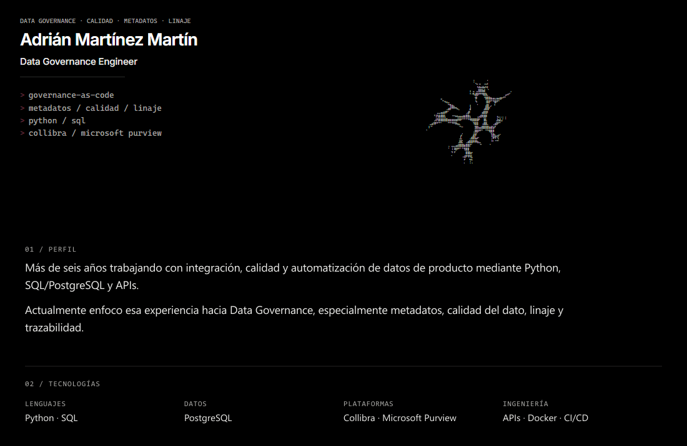

<!--
  EXPERIMENTAL — fix/seamless-responsive-profile
  Canvas continuo + <picture> + enlaces reales compactos.
-->

<a href="./README.md">EN</a> · <a href="./README.es.md"><strong>ES</strong></a>

<picture>
<source media="(max-width: 768px)" srcset="./assets/profile-final/es/mobile-v2.gif" />

</picture>

<a href="https://adrianmartnez.dev">Portfolio</a> · <a href="https://www.linkedin.com/in/adrian-martinez-martin">LinkedIn</a>

