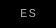
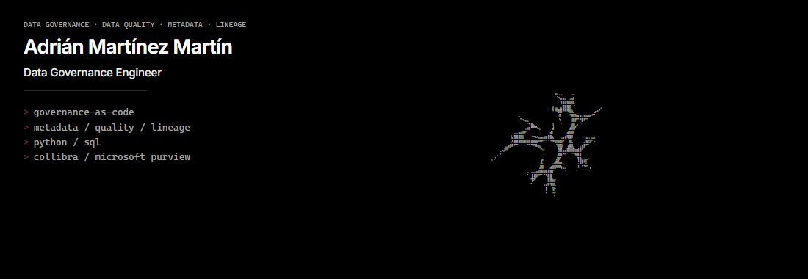
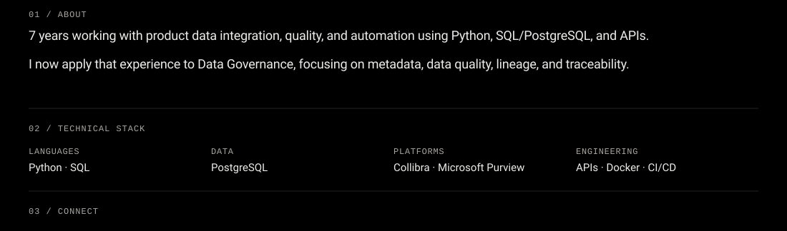
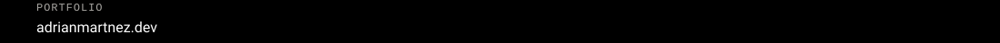

<!--
  GitHub Profile README (EN).
  Continuous black module: table cellpadding/cellspacing 0 + bgcolor #000.
  EN/ES = compact tiles only (no fill/pad image → avoids wrap + floating band).
  body.svg = About + Stack + Connect header on one surface.
  Portfolio / LinkedIn remain independent links.
  Limitation: without overlay CSS, langs sit in a 20px chrome row above the hero,
  sharing the same #000 so they read as one module (not a separate floating bar).
-->
<table align="center" border="0" cellpadding="0" cellspacing="0" width="100%">
<tr>
<td align="right" bgcolor="#000000">

</td>
</tr>
<tr>
<td bgcolor="#000000">

</td>
</tr>
<tr>
<td bgcolor="#000000">

</td>
</tr>
<tr>
<td bgcolor="#000000">

</td>
</tr>
<tr>
<td bgcolor="#000000">

</td>
</tr>
</table>
