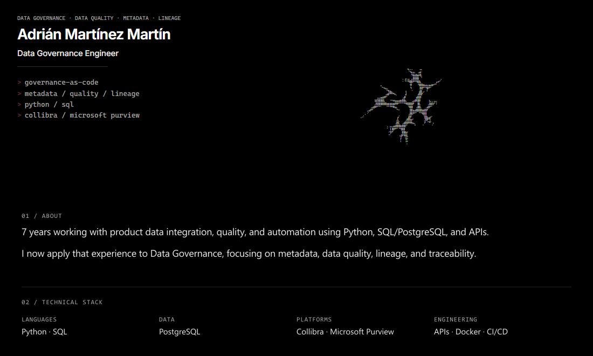

<!--
  EXPERIMENTAL — fix/seamless-responsive-profile
  Seamless canvas GIF + <picture> + compact real links (no extra tables).
-->

<a href="./README.md"><strong>EN</strong></a> · <a href="./README.es.md">ES</a>

<picture>
<source media="(max-width: 768px)" srcset="./assets/profile-final/en/mobile-v2.gif" />

</picture>

<a href="https://adrianmartnez.dev">Portfolio</a> · <a href="https://www.linkedin.com/in/adrian-martinez-martin">LinkedIn</a>

